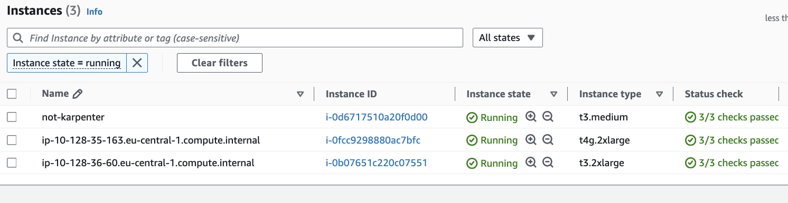

# Karpenter task For OF

For `Automate EKS cluster setup with Karpenter and Graviton on AWS` task we will follow the least efforts path and re-use the `terraform-aws-modules/eks/aws` Terraform Community modules required to complete the setup, with some augmentations that allow us to satisfy acceptance criteria.
We start with a simple deployment, so no advanced Cluster features, access policies, terraform tests, terraform remote state, etc will be configured.
Because we don't have a VPN or AWS Direct Connect established yet, Cluster API server endpoint needs to be exposed to a public network. We expect the VPC and Subnets are properly configured, have ingress and egress traffic enabled and tagged according to the [Karpenter expectations](https://karpenter.sh/docs/concepts/nodeclasses/#specsubnetselectorterms).


## Requirements
You will need a [terraform](https://www.terraform.io/) and [kubectl](https://kubernetes.io/docs/reference/kubectl/) installed and added to your shell $PATH. 
`kubectl` has to be configured to use correct Cluster context to perform queries against EKS cluster.

| Name | Version |
|------|---------|
| <a name="requirement_terraform"></a> [terraform](#requirement\_terraform) | >= 1.3.2 |
| <a name="requirement_aws"></a> [aws](#requirement\_aws) | >= 5.74 |
| <a name="requirement_helm"></a> [helm](#requirement\_helm) | >= 2.7 |
| <a name="requirement_kubectl"></a> [kubectl](#requirement\_kubectl) | >= 2.0 |

## Usage

1. Configure the `main` AWS provider in the [eks-with-karpenter.tf](./eks-with-karpenter.tf) file, by setting up the `region` and `profile` of your AWS account.
```bash
$ cat eks-with-karpenter.tf
provider "aws" {
  alias   = "main"
  region  = "your-region"
  profile = "aws-profile"
}
...
```

2. Initiate modules.

```bash
$ terraform init
```

3. Please define VPC and your Private Subnet identifiers in the [fleet.tfvars](./fleet.tfvars) file. Next generate and review the changeset for resources that will be created.

```bash
$ terraform plan -var-file="fleet.tfvars"
```

4. If the changeset satisfies your expectations - apply it.

```bash
$ terraform apply -var-file="fleet.tfvars"
```

5. Configure the EKS Cluster access for your `kubectl` and verify the result.

```bash
$ aws eks update-kubeconfig --region ${AWS_REGION} --name my-cluster --kubeconfig ${KUBE_CONFIG}
...

$ k get pods -A
NAMESPACE     NAME                                READY   STATUS    RESTARTS      AGE
kube-system   aws-node-4zkvh                      2/2     Running   0             68m
kube-system   coredns-5b7fb68d97-2qvhf            1/1     Running   0             67m
kube-system   coredns-5b7fb68d97-x55qv            1/1     Running   0             66m
...
```

6. Verify the Karpenter setup by deploying and scaling two resources from the [InflateDeploymentExample.yaml](./InflateDeploymentExample.yaml).

One `Deployment` resource acts as an example of how to deploy `amd`-based workload and another as `arm`-based one.

```bash
$ kubectl apply -f InflateDeploymentExample.yaml
$ kubectl scale deployment inflate-amd --replicas 5
$ kubectl scale deployment inflate-arm --replicas 5
$ kubectl logs -n kube-system -l app.kubernetes.io/instance=karpenter -f
```

The result should be similar to 

